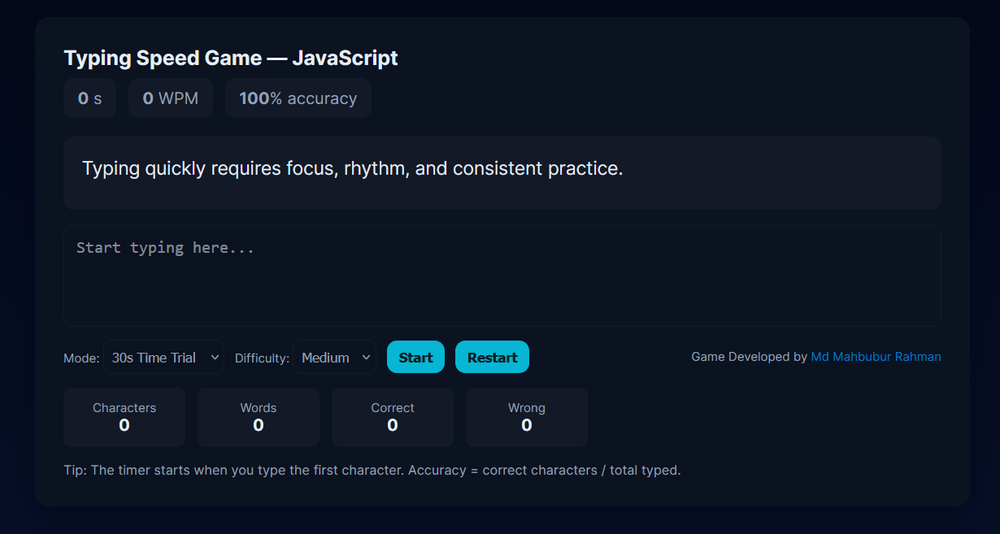

# 🕹️ Typing Speed Game

A lightweight, interactive **Typing Speed Game** built using **HTML,
CSS, and JavaScript**.\
Test your typing speed, accuracy, and focus in a simple, visually
appealing browser-based game --- no libraries or frameworks required!

------------------------------------------------------------------------

## 🚀 Features

-   ⏱️ **Real-time Timer** --- 30-second challenge mode.\
-   📈 **Live Stats** --- Displays Words Per Minute (WPM) and typing
    accuracy.\
-   🎯 **Per-Character Highlighting** --- Green for correct, red for
    wrong.\
-   🔁 **Restart Option** --- Instantly replay or switch difficulty.\
-   💾 **Local Storage Support** --- Automatically saves and displays
    your best score.\
-   📱 **Responsive Design** --- Works smoothly on desktop and mobile
    browsers.

------------------------------------------------------------------------

## 🧩 Tech Stack

-   **HTML5** -- Game layout and structure\
-   **CSS3** -- Styling, animations, and responsive UI\
-   **Vanilla JavaScript (ES6)** -- Game logic, event handling, and
    scoring

------------------------------------------------------------------------

## 🧠 How to Play

1.  Click **"Start Game"** to begin.\
2.  Type the displayed sentence as accurately and quickly as possible.\
3.  The timer counts down from 30 seconds.\
4.  Watch your **WPM** and **Accuracy** update in real time.\
5.  When time's up (or you finish typing), view your score and restart
    anytime.

------------------------------------------------------------------------

## 🏗️ Installation

1.  Clone this repository:

    ``` bash
    git clone https://github.com/your-username/typing-speed-game.git
    ```

2.  Navigate into the project folder:

    ``` bash
    cd typing-speed-game
    ```

3.  Open `index.html` in your browser.

That's it --- you're ready to play!

------------------------------------------------------------------------

## 📊 Game Preview

\
*(Add a screenshot of your game here)*

------------------------------------------------------------------------

## 🛠️ Future Enhancements

-   Multiplayer mode (real-time typing race using WebSockets)\
-   Leaderboard with cloud database (Firebase or Supabase)\
-   Custom difficulty settings and themes\
-   Sound effects and animations for better immersion

------------------------------------------------------------------------

## 📄 License

This project is licensed under the **Apache 2.0** --- free to use,
modify, and share with attribution.

